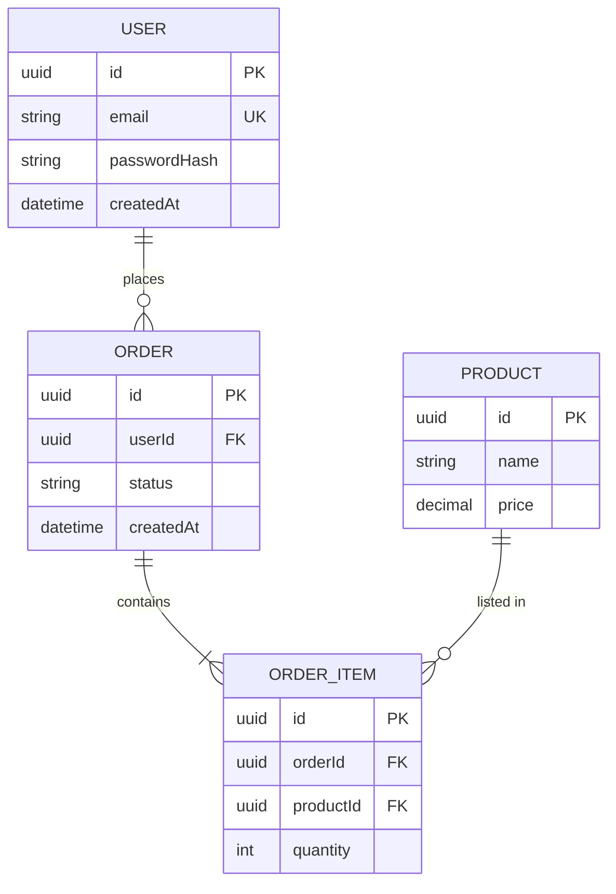

# ERD.md

Create `ERD.md` at the project root before implementing database schema, entities, repositories, or migrations.

## When to Create

Create or update `ERD.md` when:

- Starting a new project that stores data
- Adding, removing, or renaming entities
- Changing attributes, keys, or relationships
- The user asks for an ERD, database design, or schema model

Skip only when the project has no persistent data, or the user asks to skip.

## Workflow

1. Identify entities from the project requirements.
2. List attributes, primary keys, and foreign keys.
3. Determine relationships and cardinality (`1:1`, `1:N`, `N:M`).
4. Write `ERD.md` with the required sections and a Mermaid diagram.
5. Use the diagram as the source of truth for schema implementation.
6. Update `ERD.md` before changing the implemented schema.

Do not implement tables or ORM entities that are missing from `ERD.md`.

## Required Sections

Write `ERD.md` with these sections in order:

1. `# ERD`
2. `## Overview` — one short paragraph
3. `## Diagram` — one Mermaid `erDiagram` block
4. `## Entities` — heading and column table per entity
5. `## Relationships` — cardinality table
6. `## Notes` — indexes, enums, unique rules, delete behavior

Entity column table:

| Column | Type | Constraints | Description |
| --- | --- | --- | --- |
| id | UUID | PK | Unique identifier |

Relationship table:

| From | To | Cardinality | Description |
| --- | --- | --- | --- |
| User | Order | 1:N | A user places many orders |

## Diagram Example

## Mermaid Notation

Use `erDiagram` only.

| Symbol | Meaning |
| --- | --- |
| `||--||` | exactly one to exactly one |
| `||--o{` | one to zero-or-more |
| `||--|{` | one to one-or-more |
| `}o--o{` | many to many (prefer a join entity instead) |

Attribute suffixes:

- `PK` — primary key
- `FK` — foreign key
- `UK` — unique

Entity names: `UPPER_SNAKE` in the diagram (`USER`, `ORDER_ITEM`).
Relationship labels: short verbs (`places`, `contains`, `owns`).

## Rules

- One file: `ERD.md` at the project root.
- Cover every persistent entity the project will implement.
- Show every relationship that will exist in the database.
- Prefer a join entity over `}o--o{` for N:M.
- Keep types consistent with the stack (UUID, string, int, boolean, datetime, decimal).
- After schema changes, update the diagram, entity tables, and relationship table together.
