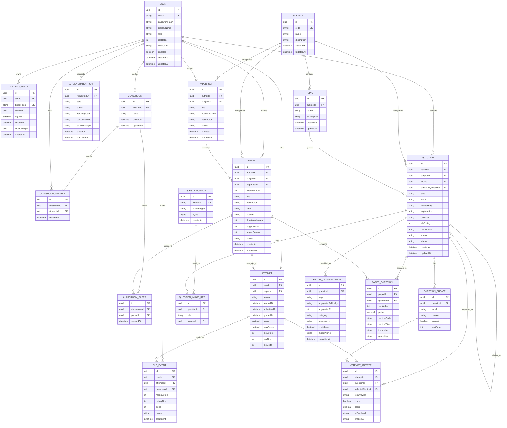

# ERD

## Overview

PostgreSQL schema for the exam warehouse: users with Elo/rank, classrooms, a question bank, paper sets (bộ đề), papers (exams, assignments, practice sets), attempts, Elo history, AI classification, AI generation jobs, and PNG snapshots for TS10 stems/solutions.

## Diagram

## Entities

### USER

| Column | Type | Constraints | Description |
| --- | --- | --- | --- |
| id | UUID | PK | Unique identifier |
| email | string | UK, NOT NULL | Login email |
| password_hash | string | NOT NULL | BCrypt hash |
| display_name | string | NOT NULL | Public name |
| role | string | NOT NULL | STUDENT, TEACHER, ADMIN |
| elo_rating | int | NOT NULL | Current Elo, default 1000 |
| rank_code | string | NOT NULL | Rank derived from Elo |
| enabled | boolean | NOT NULL | Account flag |
| created_at | datetime | NOT NULL | Created time |
| updated_at | datetime | NOT NULL | Updated time |

### REFRESH_TOKEN

| Column | Type | Constraints | Description |
| --- | --- | --- | --- |
| id | UUID | PK | Unique identifier |
| user_id | UUID | FK USER, NOT NULL | Token owner |
| token_hash | string | UK, NOT NULL | SHA-256 of refresh token |
| family_id | UUID | NOT NULL | Rotation family |
| expires_at | datetime | NOT NULL | Expiry |
| revoked_at | datetime | | Set on rotation or logout |
| replaced_by_id | UUID | | Next token in family |
| created_at | datetime | NOT NULL | Created time |

### SUBJECT

| Column | Type | Constraints | Description |
| --- | --- | --- | --- |
| id | UUID | PK | Unique identifier |
| code | string | UK, NOT NULL | Short code (MATH, ENG) |
| name | string | NOT NULL | Display name |
| description | string | | Optional description |
| created_at | datetime | NOT NULL | Created time |
| updated_at | datetime | NOT NULL | Updated time |

### TOPIC

| Column | Type | Constraints | Description |
| --- | --- | --- | --- |
| id | UUID | PK | Unique identifier |
| subject_id | UUID | FK SUBJECT, NOT NULL | Parent subject |
| name | string | NOT NULL | Topic name |
| description | string | | Optional description |
| created_at | datetime | NOT NULL | Created time |
| updated_at | datetime | NOT NULL | Updated time |

### QUESTION

| Column | Type | Constraints | Description |
| --- | --- | --- | --- |
| id | UUID | PK | Unique identifier |
| author_id | UUID | FK USER, NOT NULL | Creator |
| subject_id | UUID | FK SUBJECT, NOT NULL | Subject |
| topic_id | UUID | FK TOPIC | Optional topic |
| similar_to_question_id | UUID | FK QUESTION | Source item for AI similar generation |
| type | string | NOT NULL | MULTIPLE_CHOICE, TRUE_FALSE, SHORT_ANSWER, ESSAY |
| stem | string | NOT NULL | Question text |
| answer_key | string | | Expected answer for non-MCQ |
| explanation | string | | Solution notes |
| difficulty | string | NOT NULL | BEGINNER, INTERMEDIATE, ADVANCED, EXPERT |
| elo_rating | int | NOT NULL | Item difficulty rating |
| bloom_level | string | | REMEMBER, UNDERSTAND, APPLY, ANALYZE, EVALUATE, CREATE |
| source | string | NOT NULL | UPLOAD, MANUAL, AI_GENERATED |
| status | string | NOT NULL | DRAFT, PUBLISHED, ARCHIVED |
| created_at | datetime | NOT NULL | Created time |
| updated_at | datetime | NOT NULL | Updated time |

### QUESTION_IMAGE

| Column | Type | Constraints | Description |
| --- | --- | --- | --- |
| id | UUID | PK | Unique identifier |
| filename | string | UK, NOT NULL | Original snapshot name, e.g. e01-i-01.png |
| content_type | string | NOT NULL | MIME type, image/png |
| bytes | bytes | NOT NULL | PNG file contents |
| created_at | datetime | NOT NULL | Created time |

### QUESTION_IMAGE_REF

| Column | Type | Constraints | Description |
| --- | --- | --- | --- |
| id | UUID | PK | Unique identifier |
| question_id | UUID | FK QUESTION, NOT NULL | Question that shows the image |
| role | string | NOT NULL | STEM or EXPLANATION |
| image_id | UUID | FK QUESTION_IMAGE, NOT NULL | Snapshot bytes |

### QUESTION_CHOICE

| Column | Type | Constraints | Description |
| --- | --- | --- | --- |
| id | UUID | PK | Unique identifier |
| question_id | UUID | FK QUESTION, NOT NULL | Parent question |
| label | string | NOT NULL | A, B, C, D |
| content | string | NOT NULL | Choice text |
| correct | boolean | NOT NULL | Whether this choice is correct |
| sort_order | int | NOT NULL | Display order |

### QUESTION_CLASSIFICATION

| Column | Type | Constraints | Description |
| --- | --- | --- | --- |
| id | UUID | PK | Unique identifier |
| question_id | UUID | FK QUESTION, NOT NULL | Classified question |
| tags | string | | JSON array of tags |
| suggested_difficulty | string | | AI difficulty |
| suggested_elo | int | | AI item rating |
| category | string | | Topic/category label |
| bloom_level | string | | Suggested Bloom level |
| confidence | decimal | | 0–1 confidence |
| model_name | string | NOT NULL | Model or heuristic |
| classified_at | datetime | NOT NULL | Classification time |

### PAPER_SET

| Column | Type | Constraints | Description |
| --- | --- | --- | --- |
| id | UUID | PK | Unique identifier |
| author_id | UUID | FK USER, NOT NULL | Creator |
| subject_id | UUID | FK SUBJECT, NOT NULL | Subject |
| title | string | NOT NULL | Set title (bộ đề) |
| academic_year | string | | School year, e.g. 2025-2026 |
| description | string | | Summary |
| status | string | NOT NULL | DRAFT, PUBLISHED, ARCHIVED |
| created_at | datetime | NOT NULL | Created time |
| updated_at | datetime | NOT NULL | Updated time |

### CLASSROOM

| Column | Type | Constraints | Description |
| --- | --- | --- | --- |
| id | UUID | PK | Unique identifier |
| teacher_id | UUID | FK USER, NOT NULL | Teacher who owns the class |
| name | string | NOT NULL | Class name |
| created_at | datetime | NOT NULL | Created time |
| updated_at | datetime | NOT NULL | Updated time |

### CLASSROOM_MEMBER

| Column | Type | Constraints | Description |
| --- | --- | --- | --- |
| id | UUID | PK | Unique identifier |
| classroom_id | UUID | FK CLASSROOM, NOT NULL | Class |
| student_id | UUID | FK USER, NOT NULL | Enrolled student |
| created_at | datetime | NOT NULL | When the teacher added the student |

Unique: `(classroom_id, student_id)`.

### CLASSROOM_PAPER

| Column | Type | Constraints | Description |
| --- | --- | --- | --- |
| id | UUID | PK | Unique identifier |
| classroom_id | UUID | FK CLASSROOM, NOT NULL | Class that can see the paper |
| paper_id | UUID | FK PAPER, NOT NULL | Paper shared with the class |
| created_at | datetime | NOT NULL | When the teacher shared the paper |

Unique: `(classroom_id, paper_id)`. A paper linked here is hidden from the public catalog and opens only for the class teacher, enrolled students, the author, and admins.

### PAPER

| Column | Type | Constraints | Description |
| --- | --- | --- | --- |
| id | UUID | PK | Unique identifier |
| author_id | UUID | FK USER, NOT NULL | Creator (user or system actor) |
| subject_id | UUID | FK SUBJECT, NOT NULL | Subject |
| paper_set_id | UUID | FK PAPER_SET | Parent exam set; null for standalone papers |
| exam_number | int | | Order inside the set (Đề số 1…) |
| title | string | NOT NULL | Title |
| description | string | | Summary |
| kind | string | NOT NULL | EXAM, ASSIGNMENT, PRACTICE |
| source | string | NOT NULL | MANUAL, AI_GENERATED |
| duration_minutes | int | NOT NULL | Time limit |
| target_elo_min | int | NOT NULL | Lower Elo bound |
| target_elo_max | int | NOT NULL | Upper Elo bound |
| status | string | NOT NULL | DRAFT, PUBLISHED, ARCHIVED |
| created_at | datetime | NOT NULL | Created time |
| updated_at | datetime | NOT NULL | Updated time |

### PAPER_QUESTION

| Column | Type | Constraints | Description |
| --- | --- | --- | --- |
| id | UUID | PK | Unique identifier |
| paper_id | UUID | FK PAPER, NOT NULL | Parent paper |
| question_id | UUID | FK QUESTION, NOT NULL | Included question |
| sort_order | int | NOT NULL | Question order |
| points | decimal | NOT NULL | Score weight |
| section_code | string | | PART_I, PART_II, PART_III |
| section_title | string | | Display title of the part |
| item_label | string | | Câu label, e.g. I.3 or II.1a |
| group_key | string | | Groups Part II items into one on-screen câu |

Unique: `(paper_id, question_id)`.

### ATTEMPT

| Column | Type | Constraints | Description |
| --- | --- | --- | --- |
| id | UUID | PK | Unique identifier |
| user_id | UUID | FK USER, NOT NULL | Examinee |
| paper_id | UUID | FK PAPER, NOT NULL | Paper taken |
| status | string | NOT NULL | IN_PROGRESS, SUBMITTED, GRADED |
| started_at | datetime | NOT NULL | Start time |
| submitted_at | datetime | | Submit time |
| graded_at | datetime | | Grade time |
| score | decimal | | Awarded score |
| max_score | decimal | | Maximum score |
| elo_before | int | | Rating before grade |
| elo_after | int | | Rating after grade |
| elo_delta | int | | Change applied |

### ATTEMPT_ANSWER

| Column | Type | Constraints | Description |
| --- | --- | --- | --- |
| id | UUID | PK | Unique identifier |
| attempt_id | UUID | FK ATTEMPT, NOT NULL | Parent attempt |
| question_id | UUID | FK QUESTION, NOT NULL | Answered question |
| selected_choice_id | UUID | FK QUESTION_CHOICE | MCQ selection |
| text_answer | string | | Short/essay answer |
| correct | boolean | | Correctness |
| score | decimal | | Points awarded |
| ai_feedback | string | | Grader comments |
| graded_by | string | | AUTO, AI, TEACHER |

### ELO_EVENT

| Column | Type | Constraints | Description |
| --- | --- | --- | --- |
| id | UUID | PK | Unique identifier |
| user_id | UUID | FK USER, NOT NULL | Rated user |
| attempt_id | UUID | FK ATTEMPT | Related attempt |
| question_id | UUID | FK QUESTION | Related question |
| rating_before | int | NOT NULL | Previous Elo |
| rating_after | int | NOT NULL | New Elo |
| delta | int | NOT NULL | Change |
| reason | string | NOT NULL | ATTEMPT_GRADED, AI_ADJUSTMENT, MANUAL |
| created_at | datetime | NOT NULL | Event time |

### AI_GENERATION_JOB

| Column | Type | Constraints | Description |
| --- | --- | --- | --- |
| id | UUID | PK | Unique identifier |
| requested_by | UUID | FK USER, NOT NULL | Requester |
| type | string | NOT NULL | CLASSIFY, GRADE, SIMILAR_QUESTION, PRACTICE_PAPER, ELO |
| status | string | NOT NULL | PENDING, RUNNING, COMPLETED, FAILED |
| input_payload | string | NOT NULL | JSON request |
| output_payload | string | | JSON result |
| error_message | string | | Failure detail |
| created_at | datetime | NOT NULL | Created time |
| completed_at | datetime | | Finished time |

## Relationships

| From | To | Cardinality | Description |
| --- | --- | --- | --- |
| USER | REFRESH_TOKEN | 1:N | A user owns many refresh tokens |
| USER | CLASSROOM | 1:N | A teacher owns many classes |
| CLASSROOM | CLASSROOM_MEMBER | 1:N | A class enrolls many students |
| USER | CLASSROOM_MEMBER | 1:N | A student joins many classes |
| CLASSROOM | CLASSROOM_PAPER | 1:N | A class shares many papers |
| PAPER | CLASSROOM_PAPER | 1:N | A paper may be shared with many classes |
| USER | QUESTION | 1:N | A user authors many questions |
| USER | PAPER | 1:N | A user authors many papers |
| USER | PAPER_SET | 1:N | A user authors many exam sets |
| SUBJECT | PAPER_SET | 1:N | A subject categorizes many exam sets |
| PAPER_SET | PAPER | 1:N | A set contains ordered exams |
| USER | ATTEMPT | 1:N | A user takes many attempts |
| USER | ELO_EVENT | 1:N | A user has many Elo events |
| USER | AI_GENERATION_JOB | 1:N | A user requests many AI jobs |
| SUBJECT | TOPIC | 1:N | A subject contains many topics |
| SUBJECT | QUESTION | 1:N | A subject categorizes many questions |
| SUBJECT | PAPER | 1:N | A subject categorizes many papers |
| TOPIC | QUESTION | 1:N | A topic groups many questions |
| QUESTION | QUESTION_IMAGE_REF | 1:N | A question may have a stem snapshot and a lời giải snapshot |
| QUESTION_IMAGE | QUESTION_IMAGE_REF | 1:N | A snapshot can be reused by many questions |
| QUESTION | QUESTION_CHOICE | 1:N | A question has many choices |
| QUESTION | QUESTION_CLASSIFICATION | 1:N | A question has classification history |
| QUESTION | QUESTION | 1:N | A question may spawn similar questions |
| PAPER | PAPER_QUESTION | 1:N | A paper contains ordered questions |
| QUESTION | PAPER_QUESTION | 1:N | A question appears in many papers |
| PAPER | ATTEMPT | 1:N | A paper is taken many times |
| ATTEMPT | ATTEMPT_ANSWER | 1:N | An attempt records many answers |
| QUESTION | ATTEMPT_ANSWER | 1:N | A question is answered in many attempts |
| QUESTION_CHOICE | ATTEMPT_ANSWER | 1:N | A choice may be selected in answers |
| ATTEMPT | ELO_EVENT | 1:N | Grading an attempt may emit Elo events |

## Notes

- IDs are UUID. Enums are stored as VARCHAR (`STRING` in JPA).
- Rank codes from Elo: `BRONZE` < 1000, `SILVER` 1000–1199, `GOLD` 1200–1399, `PLATINUM` 1400–1599, `DIAMOND` ≥ 1600. New users start at Elo 1000 / `SILVER`.
- Index foreign keys and list filters: `users.email`, `questions.subject_id`, `questions.elo_rating`, `papers.kind`, `papers.target_elo_min/max`, `attempts.user_id`, `elo_events.user_id`.
- Unique: `users.email`, `subjects.code`, `refresh_tokens.token_hash`, `paper_questions(paper_id, question_id)`, `papers(paper_set_id, exam_number)` when `paper_set_id` is set, `question_images.filename`, `question_image_refs(question_id, role)`, `classroom_members(classroom_id, student_id)`, `classroom_papers(classroom_id, paper_id)`.
- `users.display_name` is not unique. Adding a student matches one enabled `STUDENT` by display name, case-insensitive. Zero or several matches are rejected.
- A teacher can share their own standalone papers and Word-uploaded exam sets into a class, and can remove those links. A paper with a `CLASSROOM_PAPER` row is class-only until the last link is removed.
- TS10 cropped PNGs live in `QUESTION_IMAGE.bytes`. `QUESTION_IMAGE_REF` attaches them as STEM or EXPLANATION so listing papers does not load blobs and so the `questions` table does not need new columns. Part II ý a–d share one stem snapshot and one lời giải snapshot.
- `PAPER_QUESTION.section_code` values: `PART_I` (12 multiple-choice × 0.25 = 3.0), `PART_II` (4 đúng/sai groups, official 0.1/0.25/0.5/1.0 scale, max 4.0), `PART_III` (6 short answers × 0.5 = 3.0). TS10 papers total 10 points. Elo uses `score / 10` against the midpoint of `papers.target_elo_min` and `papers.target_elo_max`.
- `PAPER_QUESTION.group_key` lets the take-exam UI show one Part II câu (four ý a–d) as a single step.
- Deleting a USER is not supported in v1 (accounts are disabled). Deleting a PAPER cascades to PAPER_QUESTION. Deleting a QUESTION that appears in papers is rejected at the service layer.
- `QUESTION_CLASSIFICATION.tags` is a JSON array stored as TEXT.
- `PAPER.kind` distinguishes exams, homework assignments, and generated practice sets.
